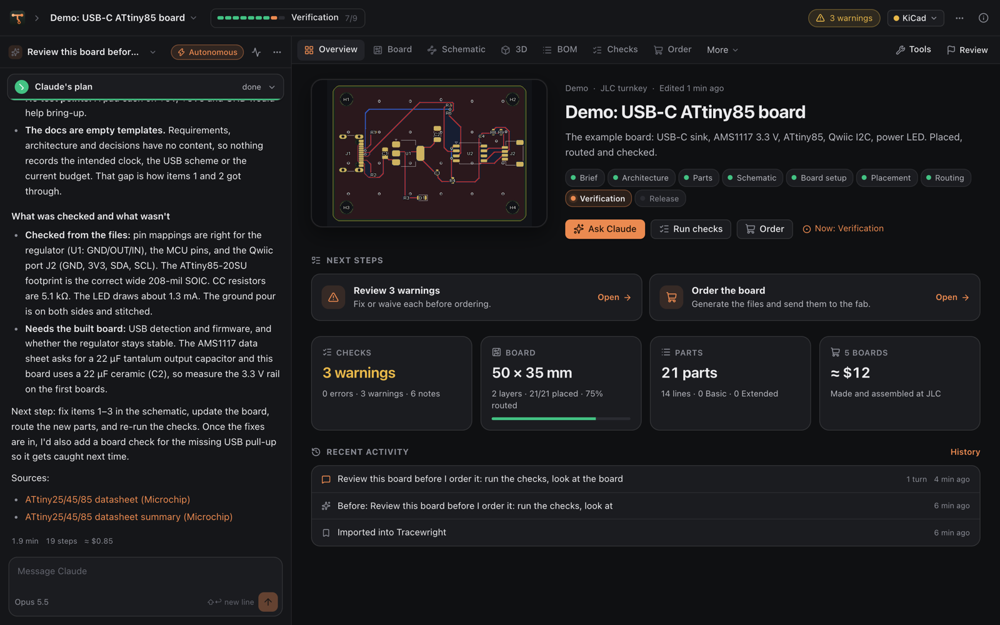
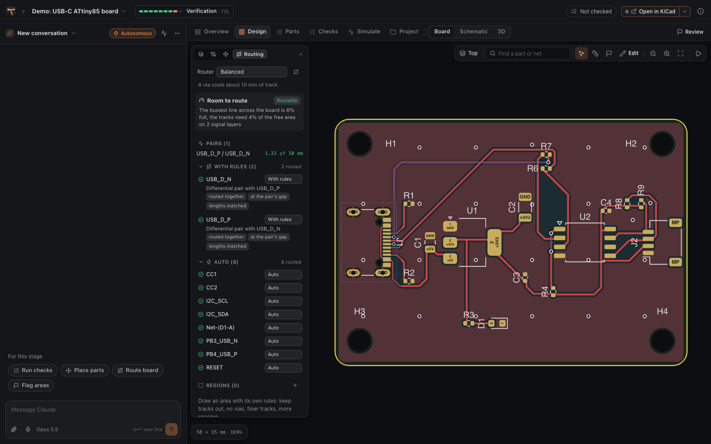
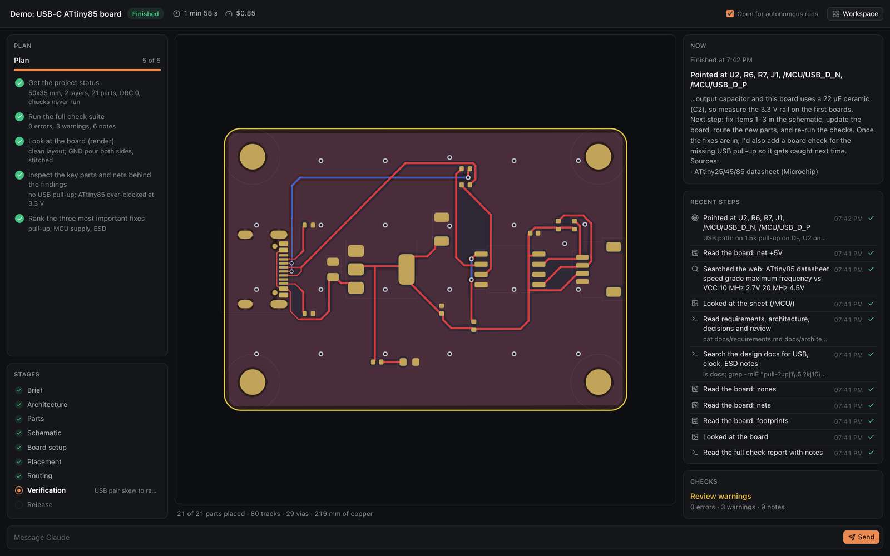
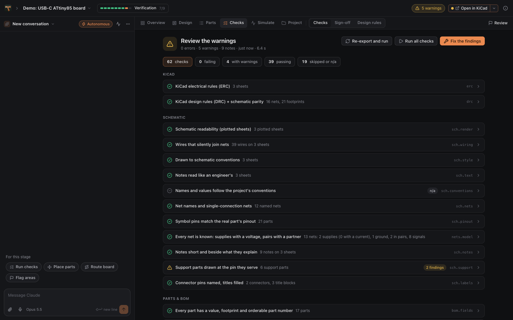
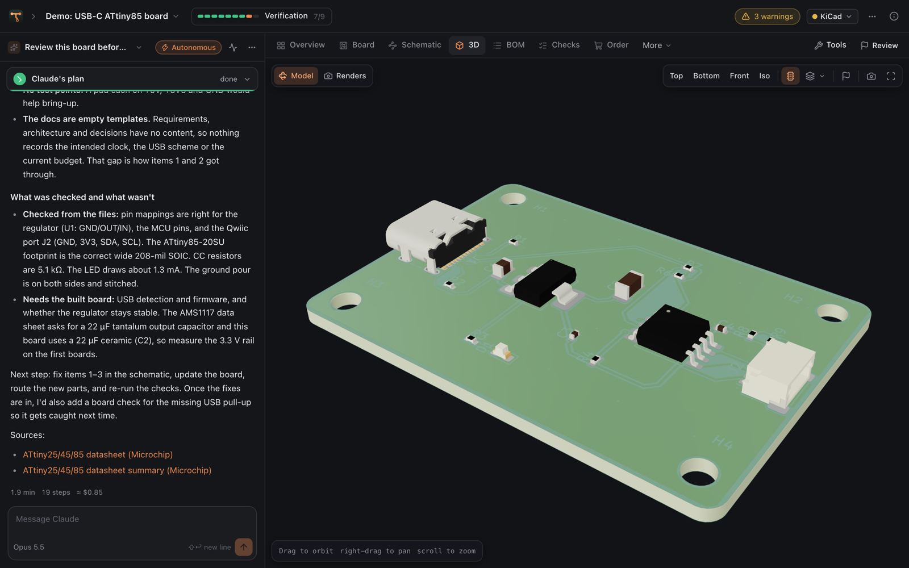

<p align="center">
  
</p>

<h1 align="center">Tracewright</h1>

<p align="center"><b>KiCad boards, designed with Claude.</b><br>
Describe a board or open one you have. Claude designs, places, routes and checks it with you,<br>
live in KiCad, then sends it to the fab.</p>

<p align="center">
  
  
  
  
</p>

<p align="center"></p>

## Features

**Design with Claude**
- **A chat beside the board.** Claude reads the schematic and board, runs the checks and makes changes with its own design tools.
- **Live in KiCad.** Placement and routing appear in KiCad's PCB Editor as Claude works.
- **You stay in control.** Claude keeps a visible plan, asks questions as cards, and reads the notes you send while it works.
- **Mission Control.** A full-screen view of autonomous runs.

**Check it**
- **50 design checks.** Schematic integrity (pinouts, packages, voltage domains), BOM, placement, routing quality, fab limits, assembly, signal integrity and power (regulators, heat, voltage drop, switchers, pours). Each check is tested against a planted fault.
- **Compare versions.** See what moved and which copper changed since any checkpoint.
- **Bring-up checklist.** Test the built board step by step, with each reading checked against the plan.

**Build it**
- **Order in one place.** JLCPCB turnkey or self-assembly, with a readiness list and a price estimate. Upload to PCBWay in one click.
- **Save money.** Exact JLC Basic equivalents for Extended parts.
- **Parts lists.** For DigiKey, Mouser and LCSC.

<p align="center">
  
  
</p>
<p align="center">
  
  
</p>

## Download

1. Download **Tracewright-&lt;version&gt;-mac.zip** from the [latest release](../../releases/latest) and move **Tracewright.app** to Applications.
2. Open it with **right-click ▸ Open** the first time (the app is not notarized yet).
3. Tracewright installs its engine in `~/.tracewright-app`, then asks you to create an account.

### Requirements

- macOS 12 or later, on Apple silicon or Intel
- Python 3.10 or later ([python.org](https://www.python.org/downloads/macos/) or Homebrew)
- KiCad 9 or 10 ([kicad.org](https://www.kicad.org/download/macos/))
- [Claude Code](https://claude.com/claude-code), signed in, or an Anthropic API key
- Optional: Java 17+ and Freerouting 2.x for whole-board autorouting

## Install from source

```sh
git clone https://github.com/benapp425/tracewright-app.git && cd tracewright-app
sh install.sh
```

This installs Tracewright in `~/.tracewright-app`, adds the `tracewright` command, and builds
`~/Applications/Tracewright.app` (the Xcode command line tools are needed: `xcode-select --install`).
Run it again to update. `sh install.sh --uninstall` removes the app and keeps your projects and settings.
`tracewright doctor` reports what it found.

## Getting started

1. **Create your account.** The first account owns the app. Google sign-in can be set up in
   Settings ▸ Account. Forgot your password? Use **Forgot?** on the sign-in screen, or run
   `tracewright account reset EMAIL`.
2. **Finish setup.** Tracewright checks KiCad and Claude, then asks for a theme and a workflow.
3. **Start a project.** Describe a new board, import a KiCad project (or Altium, Eagle, PADS,
   CADSTAR, Fabmaster or P-CAD), open the demo, or get project ideas.
4. **Order.** When the checks pass, the Order tab prepares the files and sends them to the fab.

To see Claude's edits live in KiCad, enable KiCad's API (**Preferences ▸ Plugins ▸ Enable KiCad API**),
restart KiCad and open the board in the PCB Editor.

## Project structure

```
my-board/
  tracewright.json      project settings: fab, sourcing, checks, stages
  BRIEF.md              the original description
  CLAUDE.md             instructions for Claude
  .claude/              skills for each stage, lessons, permissions
  hardware/<name>/      the KiCad project
  design/               scripts Claude writes, and project-specific checks
  docs/                 requirements, architecture, decisions, parts, review, bring-up
  tools/tw/             the toolkit (./tw <command>), usable without the app
  build/                reports, plots and fab outputs (not in git)
```

Every project works without the app: `./tw check`, `./tw route` and `./tw outputs` run from the
project folder, and Claude Code picks up the same instructions and skills there.

## Privacy

Tracewright runs on your Mac and keeps your projects there. When Claude works on a project, what it
reads (files, renders, check results) goes to Anthropic through your Claude Code sign-in or API key.
Part lookups query JLCPCB, LCSC and EasyEDA for the parts you look up. Board files are uploaded only
when you order or sync a project with GitHub. Accounts are stored in the app's data folder, with
passwords kept only as salted hashes. Once a day the app checks GitHub for a newer release
(Settings ▸ About turns this off).

## Server deployment

Tracewright can also run on a server as a web app, with accounts, uploads and GitHub import.
See [DEPLOY.md](DEPLOY.md).

## Development

```sh
python3 -m venv .venv && .venv/bin/pip install -e .
TW_ACCOUNTS=0 .venv/bin/python -m tracewright serve --port 8799   # no sign-in while developing
.venv/bin/python tests/run_tests.py                              # tests (some need KiCad)
.venv/bin/python tracewright/toolkit/tw/cli.py selftest          # every check catches its planted fault
sh macos/release.sh                                              # the downloadable app, in dist/
```

See [CHANGELOG.md](CHANGELOG.md) for release notes.

## License

MIT (see [LICENSE](LICENSE)). Tracewright works with, but does not include, KiCad (GPL-3.0+) and,
optionally, Freerouting (GPL-3.0). See [THIRD_PARTY.md](THIRD_PARTY.md).
