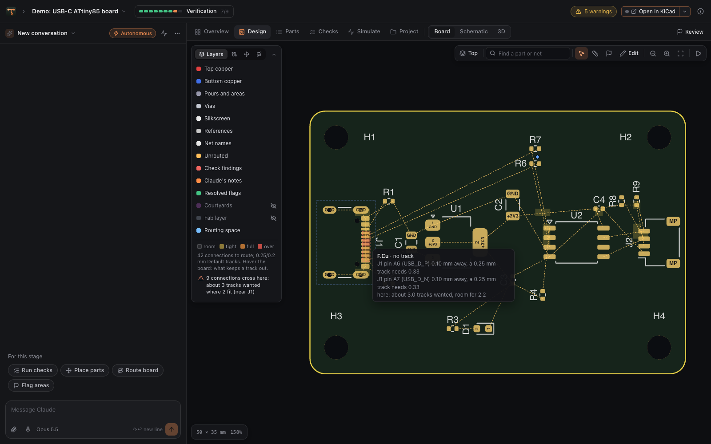
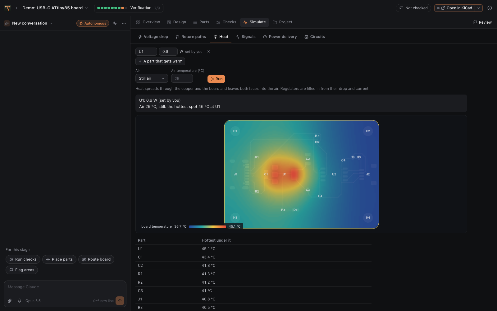
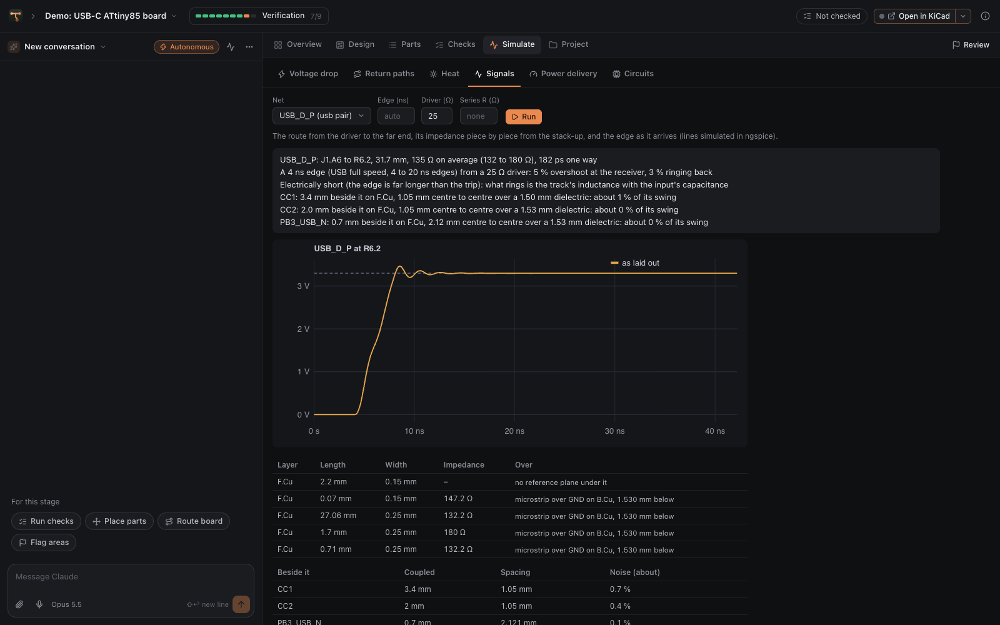
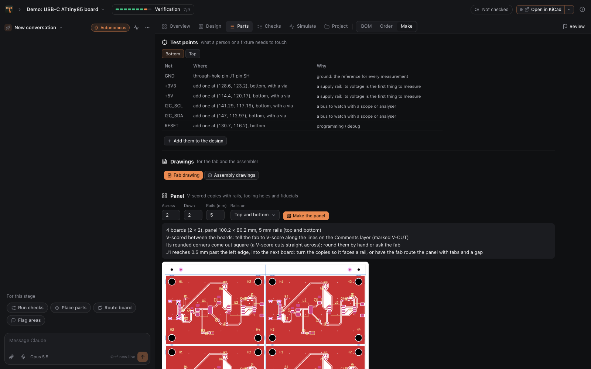
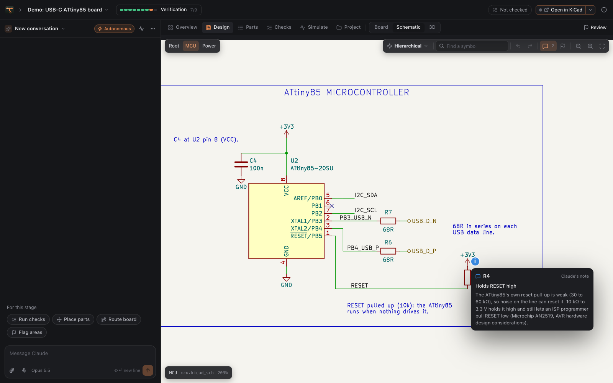

<p align="center">
  
</p>

<h1 align="center">Tracewright</h1>

<p align="center"><b>KiCad boards, designed with Claude.</b><br>
Describe a board or open one you have. Claude designs, places, routes and checks it with you,<br>
live in KiCad, then sends it to the fab.</p>

<p align="center">
  
  
  
  
</p>

<p align="center"></p>

## Features

**Design with Claude**
- **A chat beside the board.** Claude reads the schematic and board, runs the checks and makes changes with its own design tools.
- **Start from a floorplan.** Drag the board's outline, mounting holes, connectors and main parts into place. Claude lays the board out from it.
- **Live in KiCad.** Placement and routing appear in KiCad's PCB Editor as Claude works.
- **You stay in control.** Claude keeps a visible plan, asks questions as cards and reads the notes you send while it works. Each turn shows what it changed and can be undone.
- **Edit it yourself.** Move, turn and lock parts, route tracks and pairs, tune lengths, draw pours and keep-outs on the board; change a part's value or footprint and rename nets on the schematic. ⌘Z undoes each step.
- **Flags as threads.** Flag a spot on the board or schematic with a request or a question, and draw on it: where a track should go, what to keep clear. Claude answers in the thread.
- **Needs your OK.** Nothing interrupts a run. Afterwards, a short list shows what Claude went ahead with that you may want to see (a swapped part, a moved connector, your own work changed), to keep or undo.
- **Notes that read like a person wrote them.** One short line on the sheet beside the part it explains; the reasoning and its sources in the design notes, shown when you hover the part.
- **Placement with reasons.** Pick a part to see why it is where it is. Keep parts near a pin, together, apart or at an edge; Claude places around it, in stages, and scores the result.
- **A routing plan.** Each net is routed by the router, routed first with its rules (pairs, clocks, switch nodes, heavy currents), or left for you (RF, current sense, high voltage), with its reason. Pick the router's preset and keep a net to chosen layers.
- **Up to 12 layers, and HDI.** Claude plans the stack-up and routes every signal layer. HDI (vias in pads, microvias, blind vias) stays off unless you turn it on.
- **Dense boards.** Before routing, each BGA is broken out: a via on every ball that needs one, each signal's escape out to the edge of the ball field layer by layer, and the parts under it moved off its via spots. Fine-pitch connectors get staggered vias. On a breakout board, the free GPIO move to the connector pins that lie the way they leave the chip. The board says first whether it can be routed in its room and layers.
- **Pairs to their budget.** Click a pair to see its skew against what its interface allows; the route tunes pairs and length groups within their budgets.
- **Both sides from the start.** The setup's floorplan puts blocks and connectors on the top or the bottom.
- **Where tracks fit.** See the crowded parts of the board, hover any point to see what keeps a track out, and give an area its own rules (keep-out, no vias, finer tracks, more spacing).
- **Cost before you run.** See a request's likely cost and share of your plan's limit before you send it.
- **My parts.** Save parts you have checked, with their footprints, 3D models and notes, for every project.
- **Talk, attach, point.** Dictate a message, drop in pictures and data sheets, or type @ to point Claude at a part, net or sheet.
- **Run monitor.** A full-screen view of a run: the plan, the stages, the board as it grows, and how much of your Claude plan's limit is used.

**Check it**
- **62 design checks.** Schematic integrity (pinouts, packages, voltage domains), BOM, placement, routing quality, fab limits, assembly, signal integrity and power (regulators, heat, voltage drop, switchers, pours). Each says what it examined, and each is tested against a planted fault.
- **Simulate the board as laid out.** The voltage drop and current density in a supply's copper, the board's heat, where a fast net's return current runs (and the loop it opens round a gap), a net's impedance and edge at the far end with the series resistor that would tame it, crosstalk, a rail's impedance against its target, and circuit blocks from the schematic in ngspice.
- **Sign-off.** Before anything is ordered: the verdict, every requirement with its evidence (checks, calculations, simulations, regulator heat), the waivers you approved, and what only the built board can show.
- **Compare versions.** See what moved and which copper changed since any checkpoint.
- **Bring-up.** A checklist for the built board, with each reading checked against the plan, and a firmware starter: the pin map and a bring-up sketch from the schematic.

**Build it**
- **Order in one place.** JLCPCB turnkey or self-assembly, with a readiness list and a price estimate. Upload to PCBWay in one click.
- **Stock watch.** Warns when a part runs short of what an order needs, and finds in-stock stand-ins.
- **Save money.** Exact JLC Basic equivalents for Extended parts.
- **Parts lists.** For DigiKey, Mouser and LCSC.
- **Make.** The BOM's health, a test-point plan, a fab drawing and assembly drawings, a V-scored panel with rails and fiducials, the enclosure fit with an OpenSCAD box to start from, and your blocks: circuits that worked once, saved to use again.

<p align="center">
  
  
</p>
<p align="center">
  
  
</p>
<p align="center">
  
  
</p>
<p align="center">
  
  
</p>

## Download

1. Download **Tracewright-&lt;version&gt;-mac.zip** from the [latest release](../../releases/latest) and move **Tracewright.app** to Applications.
2. Open it with **right-click ▸ Open** the first time (the app is not notarized yet).
3. Tracewright installs its engine in `~/.tracewright-app`, then asks you to create an account.

### Requirements

- macOS 12 or later, on Apple silicon or Intel
- Python 3.10 or later ([python.org](https://www.python.org/downloads/macos/) or Homebrew)
- KiCad 9 or 10 ([kicad.org](https://www.kicad.org/download/macos/))
- [Claude Code](https://claude.com/claude-code), signed in, or an Anthropic API key
- Optional: Java 17+ and Freerouting 2.x for whole-board autorouting

## Install from source

```sh
git clone https://github.com/benapp425/tracewright-app.git && cd tracewright-app
sh install.sh
```

This installs Tracewright in `~/.tracewright-app`, adds the `tracewright` command, and builds
`~/Applications/Tracewright.app` (the Xcode command line tools are needed: `xcode-select --install`).
Run it again to update. `sh install.sh --uninstall` removes the app and keeps your projects and settings.
`tracewright doctor` reports what it found.

## Getting started

1. **Create your account.** The first account owns the app. Google sign-in can be set up in
   Settings ▸ Account. Forgot your password? Use **Forgot?** on the sign-in screen, or run
   `tracewright account reset EMAIL`.
2. **Finish setup.** Tracewright checks KiCad and Claude, then asks for a theme and a workflow.
3. **Start a project.** Describe a new board, import a KiCad project (or Altium, Eagle, PADS,
   CADSTAR, Fabmaster or P-CAD), open the demo, or get project ideas.
4. **Sign off and order.** Review the findings and waivers in Checks ▸ Sign-off and sign the design off. Parts ▸ Order then
   prepares the files and sends them to the fab.

To see Claude's edits live in KiCad, enable KiCad's API (**Preferences ▸ Plugins ▸ Enable KiCad API**),
restart KiCad and open the board in the PCB Editor.

## Project structure

```
my-board/
  tracewright.json      project settings: fab, sourcing, checks, stages
  BRIEF.md              the original description
  CLAUDE.md             instructions for Claude
  .claude/              skills for each stage, lessons, permissions
  hardware/<name>/      the KiCad project, with design-notes.json (the reasoning behind the schematic)
                        and placement-plan.json (why each part is where it is, and what to keep)
  design/               scripts Claude writes, and project-specific checks
  docs/                 requirements, architecture, decisions, parts, review, bring-up
  tools/tw/             the toolkit (./tw <command>), usable without the app
  build/                reports, plots and fab outputs (not in git)
```

Every project works without the app: `./tw check`, `./tw route`, `./tw escape`, `./tw space` and
`./tw outputs` run from the project folder, and Claude Code picks up the same instructions and skills there.

## Privacy

Tracewright runs on your Mac and keeps your projects there. When Claude works on a project, what it
reads (files, renders, check results) goes to Anthropic through your Claude Code sign-in or API key.
Part lookups query JLCPCB, LCSC and EasyEDA for the parts you look up, and once a day the stock watch asks
about the parts on a board you open (Settings ▸ Watch part stock turns it off). Dictation uses Apple's speech recognition, on the Mac when
it can; in a browser, the browser's own speech service. Board files are uploaded only
when you order or sync a project with GitHub. Accounts are stored in the app's data folder, with
passwords kept only as salted hashes. Once a day the app checks GitHub for a newer release
(Settings ▸ About turns this off).

## Server deployment

Tracewright can also run on a server as a web app, with accounts, uploads and GitHub import.
See [DEPLOY.md](DEPLOY.md).

## Development

```sh
python3 -m venv .venv && .venv/bin/pip install -e .
TW_ACCOUNTS=0 .venv/bin/python -m tracewright serve --port 8799   # no sign-in while developing
.venv/bin/python tests/run_tests.py                              # tests (some need KiCad)
.venv/bin/python tracewright/toolkit/tw/cli.py selftest          # every check catches its planted fault
sh macos/release.sh                                              # the downloadable app, in dist/
```

See [CHANGELOG.md](CHANGELOG.md) for release notes.

## License

MIT (see [LICENSE](LICENSE)). Tracewright works with, but does not include, KiCad (GPL-3.0+) and,
optionally, Freerouting (GPL-3.0). See [THIRD_PARTY.md](THIRD_PARTY.md).
